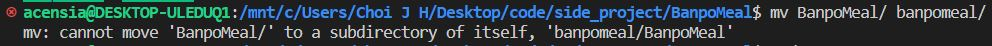
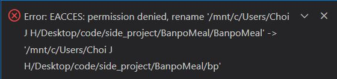
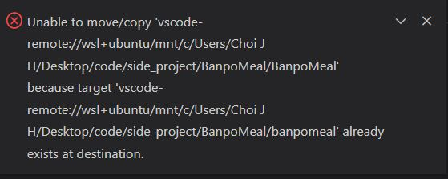

## Error code : EACCES : permission denied

WSL VScode error occured, so I googled "WSL vscode permission denied". I found the [link](https://velog.io/@gidskql6671/VSCode-WSL%ED%99%98%EA%B2%BD%EC%97%90%EC%84%9C-%EB%94%94%EB%A0%89%ED%86%A0%EB%A6%AC-%EB%B3%80%EA%B2%BD%EC%8B%9CPermission-denied-%ED%95%B4%EA%B2%B0).  

I followed 1st way.

Another error message popped up.

